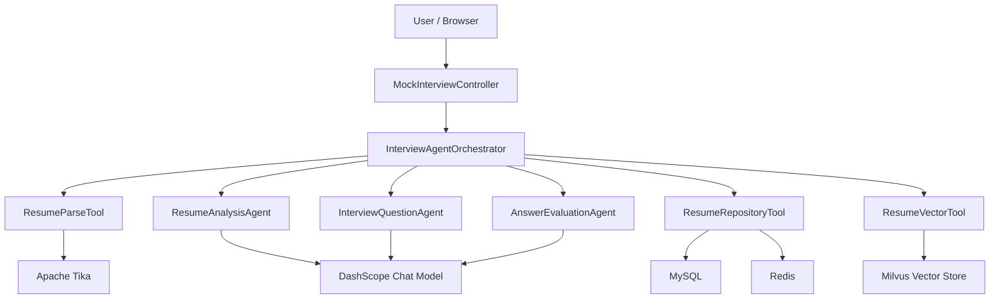

# AI Interview Agent 架构说明

## 目标定位

本项目从传统的“LLM 接口调用应用”改造成面向求职场景的 AI Agent 应用。系统将模拟面试拆成可编排的任务链路：简历解析、能力画像、问题生成、答案评估、报告生成和向量检索。

## 分层设计



## 核心角色

### Controller

只处理 HTTP 入参、响应和错误码，不直接编排业务流程，也不直接调用大模型。

### Orchestrator

`InterviewAgentOrchestrator` 是面试流程编排器，负责决定每一步调用哪个 Agent 或 Tool。

典型流程：

```text
上传简历
  -> ResumeParseTool 解析文件
  -> ResumeAnalysisAgent 生成简历评分与优化建议
  -> ResumeRepositoryTool 持久化结果并写入缓存
  -> ResumeVectorTool 写入向量库
```

### Agent

Agent 负责需要模型推理的任务，目前包含：

- `ResumeAnalysisAgent`：简历评分、能力画像、优化建议
- `InterviewQuestionAgent`：基于简历生成个性化面试题
- `AnswerEvaluationAgent`：结合简历和回答生成面试评估报告

### Tool

Tool 负责确定性能力，方便后续迁移到函数调用或工具调用框架：

- `ResumeParseTool`：文档解析
- `ResumeRepositoryTool`：MySQL + Redis 读写
- `ResumeVectorTool`：Milvus 向量写入和相似检索

## 当前边界

当前版本采用确定性 Orchestrator 编排 Agent，不做完全自主规划。这样更适合业务系统落地：链路可控、错误边界清楚、易于测试和排查。

下一阶段可以继续引入：

- JD 匹配 Agent
- RAG 增强出题 Agent
- Prompt 版本管理
- 大模型调用重试和降级策略
- JSON Schema 校验

