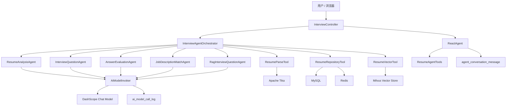

# AI 求职顾问架构说明

## 目标定位

本项目从传统的“LLM 接口调用应用”改造成面向求职场景的 AI Agent 应用。系统将模拟面试拆成可编排的任务链路：简历解析、能力画像、问题生成、答案评估、报告生成和向量检索。

## 分层设计



## 核心角色

### Controller

只处理 HTTP 入参、响应和错误码，不直接编排业务流程，也不直接调用大模型。API 错误响应统一收敛为 `{ "error": "..." }`，由 Controller 私有方法映射 400、500 和模型网关 502。

### Orchestrator

`InterviewAgentOrchestrator` 是面试流程编排器，负责决定每一步调用哪个 Agent 或 Tool。

典型流程：

```text
上传简历
  -> ResumeParseTool 解析文件
  -> ResumeAnalysisAgent 生成简历评分与优化建议
  -> ResumeRepositoryTool 持久化结果并写入缓存
  -> ResumeVectorTool 写入向量库
```

### Agent

Agent 负责需要模型推理的任务，目前包含：

- `ResumeAnalysisAgent`：简历评分、能力画像、优化建议
- `InterviewQuestionAgent`：基于简历生成个性化面试题
- `AnswerEvaluationAgent`：结合简历和回答生成面试评估报告
- `JobDescriptionMatchAgent`：分析候选人简历与目标 JD 的匹配度
- `RagInterviewQuestionAgent`：结合目标岗位说明、候选人简历和向量检索上下文生成岗位定制面试题

### ReAct Agent Runtime

`InterviewAssistantAgentService` 提供面向对话式使用的 ReAct Agent 入口。它使用 `conversationId` 作为 `RunnableConfig.threadId`，让同一会话内的 Agent 执行具备线程级上下文。

Agent 可调用的工具集中在 `ResumeAgentTools`，只暴露查询类能力：

- `get_resume_profile`：查询简历画像
- `get_resume_interview_questions`：查询已生成面试问题摘要
- `search_similar_resumes`：按文本检索相似简历片段

上传、保存、向量写入等副作用操作不暴露给模型直接调用，避免 Agent 自主执行不可控写操作。模型可见工具返回的是裁剪后的摘要或片段：简历画像只返回有限优势/建议和文本片段，面试问题最多返回前 10 题，相似简历返回 `snippet` 而不是完整简历原文。Agent 系统提示进一步区分事实来源：画像和问题工具是当前候选人的真实数据，相似简历工具只能作为同类岗位追问方向参考。

### Model Invoker

`AiModelInvoker` 统一封装大模型调用，避免每个 Agent 分散处理网络异常和模型波动。

当前治理能力：

- 基于 Spring AI Alibaba `ChatClient` 统一模型调用入口
- DashScope 客户端由 `spring-ai-alibaba-starter-dashscope` 自动装配
- HTTP connect/read timeout 使用 Spring Boot `spring.http.client.*` 和 `spring.http.reactiveclient.*` 标准配置
- 模型侧重试和退避交给 Spring AI `spring.ai.retry` 自动配置
- 调用耗时日志
- traceId 贯穿 HTTP 请求和模型调用日志
- 无可用降级时将模型调用失败映射为 502 响应
- 结构化输出治理：Spring AI `BeanOutputConverter` 负责 DTO 转换，Jakarta Bean Validation 负责必填、范围、枚举和级联校验
- Prompt 版本记录
- 调用审计落库
- 最终失败后的显式降级结果

`AiModelInvoker` 只保留业务层必须关心的审计、Prompt 版本和 fallback，不再手写 retry/backoff/线程池调度，避免和框架模型层能力重复。

### Prompt 版本

`PromptVersionRegistry` 从 `application.yml` 读取 operation 到 Prompt 版本的映射，例如：

```text
resume-analysis -> resume-analysis-v2026-05-17-01
jd-match -> jd-match-v2026-05-17-01
```

这样每次模型调用都能回溯到具体 Prompt 版本，方便比较不同版本的稳定性和效果。

### 调用审计

`ai_model_call_log` 记录模型调用审计信息：

- traceId
- operationName
- promptVersion
- success
- fallbackUsed
- attemptCount（兼容早期外层重试审计；当前模型侧重试由 Spring AI 管理）
- latencyMs
- errorMessage
- createTime

审计写入失败不会影响主业务流程。

`agent_conversation_message` 记录 Agent 对话消息审计信息：

- conversationId
- turnId
- traceId
- agentName
- role
- messageContent
- success
- latencyMs
- errorMessage
- createTime

`/api/audit/agent-messages` 可按 conversationId 或 traceId 查询最近的 Agent 对话轨迹，用于排查工具调用前后的用户输入、助手回复和失败原因。

对话正文落库可通过配置控制：

```text
AI_AGENT_AUDIT_ENABLED=true
AI_AGENT_AUDIT_LOG_MESSAGE_CONTENT=true
AI_AGENT_AUDIT_MAX_MESSAGE_CONTENT_LENGTH=4000
```

生产环境如果担心简历、JD 等敏感信息进入审计表，可以关闭 `AI_AGENT_AUDIT_LOG_MESSAGE_CONTENT`，只保留会话、轮次、耗时和错误状态。消息正文默认按 `AI_AGENT_AUDIT_MAX_MESSAGE_CONTENT_LENGTH` 裁剪，错误原因按 1024 字符裁剪；被裁剪内容会保留原始长度标记，便于排查时识别审计记录不是完整内容。

### 降级策略

`AiModelFallbackResponseFactory` 为每个 operation 提供结构合法的降级 JSON。模型最终失败时，如果 `AI_MODEL_FALLBACK_ENABLED=true`，调用器会返回降级结果，并在审计中记录：

```text
success = 0
fallbackUsed = 1
```

这表示“真实模型调用失败，但业务使用了降级响应继续执行”。

### Prompt 指标

`/api/audit/prompt-metrics` 基于最近的模型调用审计记录，按 operation 和 Prompt 版本聚合 totalCalls、successRate、fallbackRate、avgLatencyMs 和 maxLatencyMs。`avgAttemptCount` 保留用于兼容早期外层重试审计。

`/audit/prompt-dashboard` 提供一个轻量看板页面，用于查看 Prompt 版本指标和失败原因分布。

### 工具

Tool 负责确定性能力，方便后续迁移到函数调用或工具调用框架：

- `ResumeParseTool`：文档解析
- `ResumeRepositoryTool`：MySQL + Redis 读写
- `ResumeVectorTool`：Milvus 向量写入和相似检索

`ResumeRepositoryTool` 以 MySQL 为事实存储，Redis 只作为加速缓存；缓存读写失败只记录 warn，并回退到数据库主流程。评分结果继续沿用现有拆分 JSON 字段，读取时兼容历史空列表字段为空列表，避免为低收益的表结构合并引入迁移成本。保存面试问题或评估结果时，只更新对应 JSON 字段；如果目标简历不存在，会显式抛出不存在异常，不做静默跳过。

`ResumeVectorTool` 通过 Spring AI `SearchRequest.topK` 控制检索数量，避免先取默认结果再由业务代码手动截断。

## 当前边界

当前版本采用确定性 Orchestrator 编排 Agent，不做完全自主规划。这样更适合业务系统落地：链路可控、错误边界清楚、易于测试和排查。

## 岗位定制面试题生成流程

```text
输入目标岗位说明
  -> ResumeVectorTool 使用岗位说明检索相似简历片段
  -> RagInterviewQuestionAgent 组合候选人简历、JD、检索上下文
  -> 生成岗位定制化面试问题
  -> ResumeRepositoryTool 保存问题到当前会话
```

检索上下文只作为“同类岗位面试深度参考”，不会被当成候选人自己的项目经历。

下一阶段可以继续引入：

- Prompt 评估看板的时间范围筛选
- Prompt A/B 版本对比
